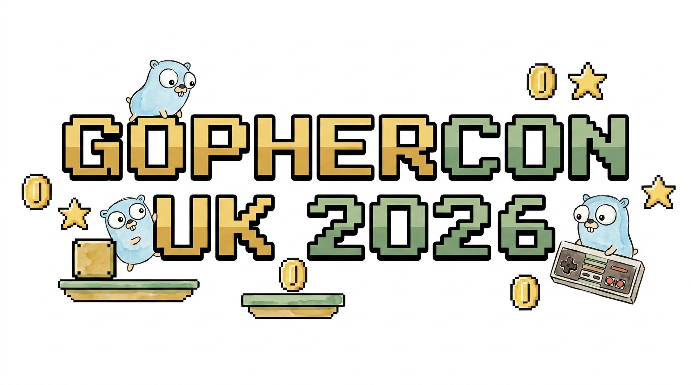

# GopherCon UK 2026: Vibe Code a 2D Game with Go and Gemini



This repository contains supporting materials, Agent Skills, and automated tools for the workshop **"Vibe Code a 2D Game with Go and Gemini"** presented at GopherCon UK in August 2026.

---

## Session Overview

In this hands-on workshop, participants build production-grade 2D games in Go using [Ebitengine v2](https://ebitengine.org/) alongside generative AI capabilities powered by Google Gemini (image generation via Nano Banana models, music/audio generation via Lyria 3, and automated Go quality tooling).

### Genre-Agnostic Design Philosophy
All skills and reference modules in this suite are **generic, modular toolkits designed for any 2D game concept** (arcade, puzzle, strategy, racing, platformer, rhythm, RPG, shmup, or simulation). Code snippets and examples (such as progress indicators, AABB collision, or A* pathfinding) are illustrative building blocks—developers and AI agents select and adapt only the components relevant to their specific game mechanics.

---

## Repository Structure

```text
.
├── .agents/
│   └── skills/                  # Specialized Agent Skills
│       ├── vibe-game-developer/ # Master orchestrator & request router for game tasks
│       ├── ebitengineer/        # Production 2D game architecture guidelines for Ebitengine
│       ├── game-design/         # Game Designer role, interactive /grill-me probing & GDD creation
│       ├── godoctor/            # Go quality, formatting, testing & mutation analysis
│       ├── lyria/               # High-fidelity music generation with Lyria 3 models
│       ├── nano-banana/         # Conversational image generation & editing via Nano Banana
│       ├── procedural-art/      # Pure-code 2D graphics, vector math, particles & Go rendering
│       ├── procedural-composer/ # Pure-code DSP audio synthesis engine, FM & JSON sound specs
│       ├── sprite-animation/    # Animator Agent role, sprite sheet slicing & Aseprite integration
│       └── swarm-coding/        # Multi-agent parallel task orchestration workflow
└── README.md
```

---

## Agent Skills Index

### 🎯 Master Orchestrator & Game Design

- **[`vibe-game-developer`](.agents/skills/vibe-game-developer/SKILL.md)**
  - Master skill that classifies user intents and routes requests to the optimal specialized skill (e.g. game concept probing, pure-code procedural audio vs. generative CD-quality music, pure-code graphics vs. generative AI images, game loop architecture, code testing, or deployment).

- **[`game-design`](.agents/skills/game-design/SKILL.md)**
  - **Game Designer Role**: Interactive `/grill-me` probing interview skill that systematically walks down the game design tree (elevator pitch, mechanics, win/loss rules, controls, art strategy, audio strategy) and outputs a structured **Game Design Document ([`GDD.md`](.agents/skills/game-design/references/gdd_template.md))** to feed downstream engineering and media skills.

---

### 🎮 Game Engineering & Pure-Code Assets (Model-Agnostic)

- **[`ebitengineer`](.agents/skills/ebitengineer/SKILL.md)**
  - Comprehensive engineering guidelines for Ebitengine v2 games.
  - **16:9 Virtual Pixel Canvas**: Fixed logical resolution scaling (`320x180`, `640x360`, `1280x720`) with automatic multi-resolution scaling.
  - **Cycle Timing**: Delta time ($dt$) synchronization targeting 60 FPS with frame skipping.
  - **Finite State Machine (FSM)**: Standardized scene flow (`Boot` $\rightarrow$ `Intro` $\rightarrow$ `Title Screen` $\rightarrow$ `Gameplay` $\rightarrow$ `Win/GameOver`) and arcade Attract/Demo mode.
  - **WebAssembly & Cloud Run**: Dockerized WASM build pipeline, late-touch audio unlock synchronization, and Go HTTP server with server-side High Score REST APIs.
  - **Asset Validation**: Strict file format identification using tools (`file`, `mimetype`, `http.DetectContentType`) to prevent WASM decoding failures.
  - **Engine Reference Modules**:
    - [`project_structure.md`](.agents/skills/ebitengineer/references/project_structure.md): Subsystem architecture under `internal/`.
    - [`server_architecture.md`](.agents/skills/ebitengineer/references/server_architecture.md): WASM build, Docker multi-stage & Cloud Run REST API.
    - [`physics_and_collision.md`](.agents/skills/ebitengineer/references/physics_and_collision.md): AABB sweep tests, Spatial Hashing & platformer slope math.
    - [`tilemaps_and_levels.md`](.agents/skills/ebitengineer/references/tilemaps_and_levels.md): Tiled/LDtk parsing, 16-pipe autotiling & frustum culling.
    - [`ui_and_hud.md`](.agents/skills/ebitengineer/references/ui_and_hud.md): 9-slice panel scaling, flex anchoring & widget state machines.
    - [`input_action_mapping.md`](.agents/skills/ebitengineer/references/input_action_mapping.md): Rebindable action maps & analog deadzones.
    - [`entity_management.md`](.agents/skills/ebitengineer/references/entity_management.md): Slice Pools, deferred deletion & Light ECS.
    - [`pathfinding_and_ai.md`](.agents/skills/ebitengineer/references/pathfinding_and_ai.md): A* grid pathfinding, steering behaviors & enemy FSM.

- **[`procedural-art`](.agents/skills/procedural-art/SKILL.md)**
  - Pure-code 2D graphics generation: matrix transformation ordering (`GeoM`), 32-bit RGBA color ramps, non-linear easing curves, pre-allocated particle pools, direct memory pixel crafting (`art.go`), and custom Kage shaders.

- **[`sprite-animation`](.agents/skills/sprite-animation/SKILL.md)**
  - **Animator Agent Role**: Specialized skill for validating sprite sheets, grid slicing, animation tag state machines (`idle`, `walk`, `attack`, `death`), Aseprite `.ase`/`.aseprite` file format specifications, GIMP `.gpl` RGBA palettes, and Ebitengine integration via [`SolarLune/goaseprite`](https://github.com/SolarLune/goaseprite).
  - Includes a production-grade Ebitengine Go animation controller in [`references/animation_controller.go`](.agents/skills/sprite-animation/references/animation_controller.go) and Aseprite binary format reference in [`references/aseprite_format.md`](.agents/skills/sprite-animation/references/aseprite_format.md).

- **[`procedural-composer`](.agents/skills/procedural-composer/SKILL.md)**
  - Master procedural audio synthesis engine: pure-code DSP synthesis (`sound.go`, FM synthesis, YM2612 6-channel polyphony, ADSR envelopes, JSON sound format, CLI player `play.go`), and state-based adaptive BGM composition rules.

---

### 🎨 Generative AI Media Skills

- **[`nano-banana`](.agents/skills/nano-banana/SKILL.md)**
  - Conversational image generation and editing using Google's native Nano Banana models (`gemini-3.1-flash-lite-image`, `gemini-3.1-flash-image`, `gemini-3.1-pro-image`, `gemini-2.5-flash-image`).
  - **Pixel Art & Character Consistency**: Generates pixel art sprites/icons and preserves visual identity for **Anime Dani**, **Daniela**, and **Chibi Dani** using reference images.
  - **CLI Automation**: Run via `uv run .agents/skills/nano-banana/scripts/banana.py`.

- **[`lyria`](.agents/skills/lyria/SKILL.md)**
  - High-fidelity **44.1 kHz stereo music** generation using Google's Lyria 3 models (`lyria-3-clip-preview` for 30s loops; `lyria-3-pro-preview` for full-length songs).
  - Generates CD-quality BGM loops, full songs with custom lyrics and section tags (`[Verse]`, `[Chorus]`, `[Bridge]`), and multimodal image-to-music compositions.
  - **CLI Automation**: Run via `uv run .agents/skills/lyria/scripts/lyria.py`.

---

### 🛠️ Go Code Quality & Orchestration

- **[`godoctor`](.agents/skills/godoctor/SKILL.md)**
  - Go quality and tooling guide adhering to Google Go Style and flat package architecture.
  - Integrates TestQuery SQL test log analyzer and Selene mutation testing to ensure test suite effectiveness.

- **[`swarm-coding`](.agents/skills/swarm-coding/SKILL.md)**
  - Orchestration framework for decomposing complex game engineering tasks across parallelized agent swarms.

---

## Quick Start & Dependencies

### Environment Requirements
- **Go**: Version 1.26+
- **uv**: Python package runner (for running CLI scripts in `nano-banana` and `lyria`)
- **GCP Credentials**: Application Default Credentials (`gcloud auth application-default login`) for Vertex AI models.

### Verification
Test image and audio skill automation scripts:
```bash
# Verify Nano Banana Image Generation CLI
uv run .agents/skills/nano-banana/scripts/banana.py --help

# Verify Lyria Music Generation CLI
uv run .agents/skills/lyria/scripts/lyria.py --help
```