# GopherCon UK 2026 Mini Game Jam

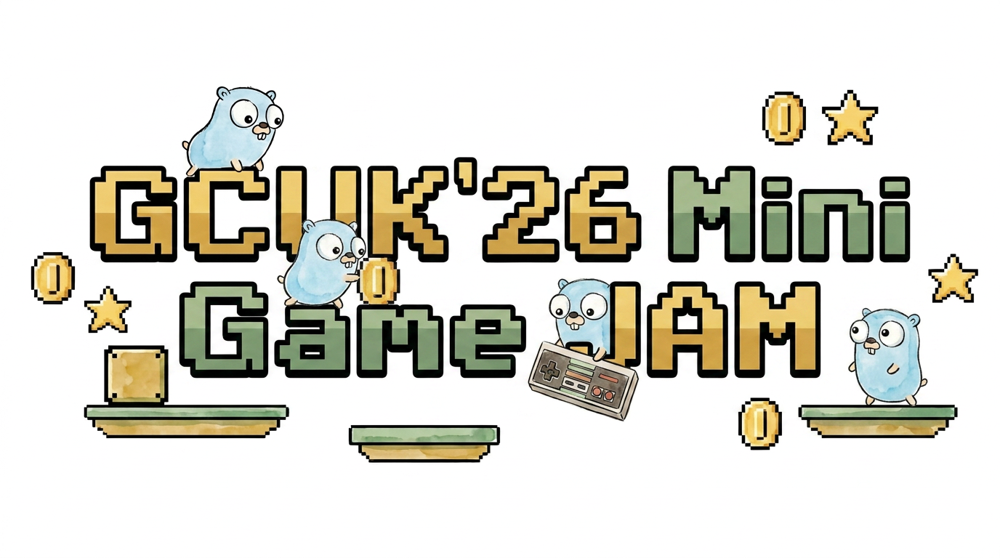

Welcome to the **GopherCon UK 2026 Mini Game Jam** submission showcase!

During the "Vibe Code a 2D Game with Go and Gemini" workshop at GopherCon UK 2026, participants created 2D games built in Go with Ebitengine v2 and AI agent tooling.

## 🏆 Submissions & Winners

| Game | Author | Description |
| :--- | :--- | :--- |
| 🥇 [**London Eco-Rider: Ice Cream & Bottle Patrol**](london-eco-rider) | **Ivan S** ([@inesusvet](https://github.com/inesusvet)) | **Jam Winner!** A fast-paced 2D side-scrolling platformer where players control Leo on his bicycle, collecting ice cream cones for turbo boosts and plastic bottles for recycling points while navigating London traffic. |

---

## 🚀 Running Entries

To run any game entry locally:

```bash
cd mini-game-jam/london-eco-rider
go run ./cmd/game
```

---

## 📸 Event Gallery & Highlights

### Workshop & Jam Atmosphere

| Workshop Room | Host & Organizer |
| :---: | :---: |
| 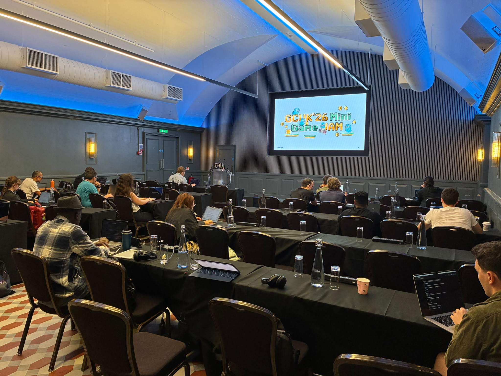<br>_Participants hacking on 2D games during the workshop_ | 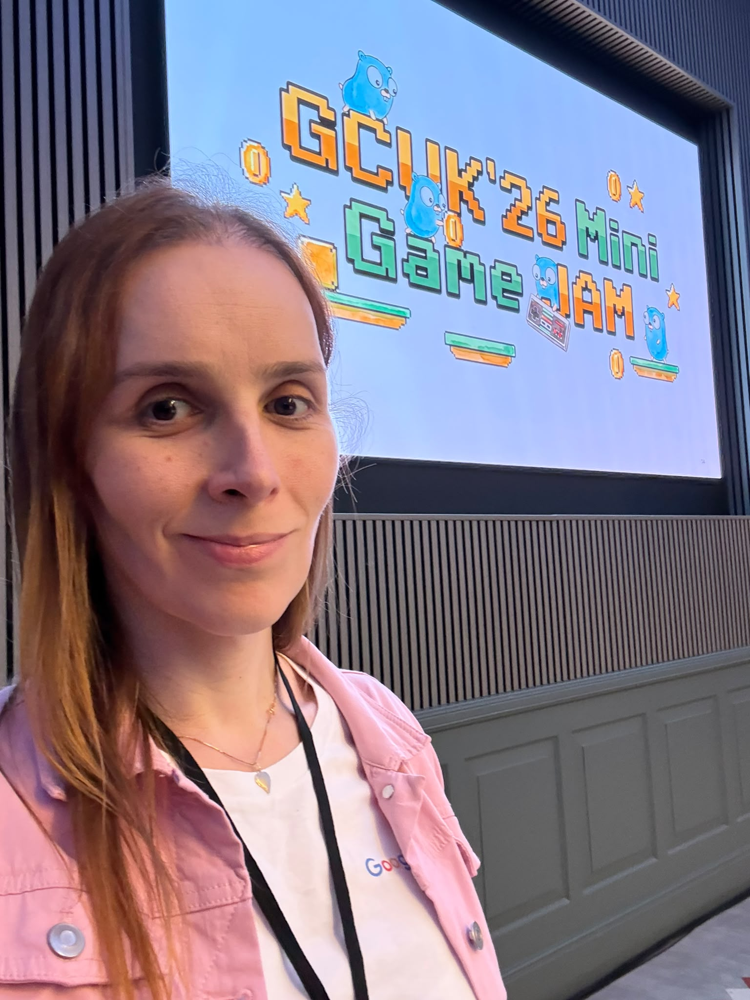<br>_Workshop host Dani Petruzalek at GCUK'26 Mini Game Jam_ |

### 🥇 Jam Winner Showcase

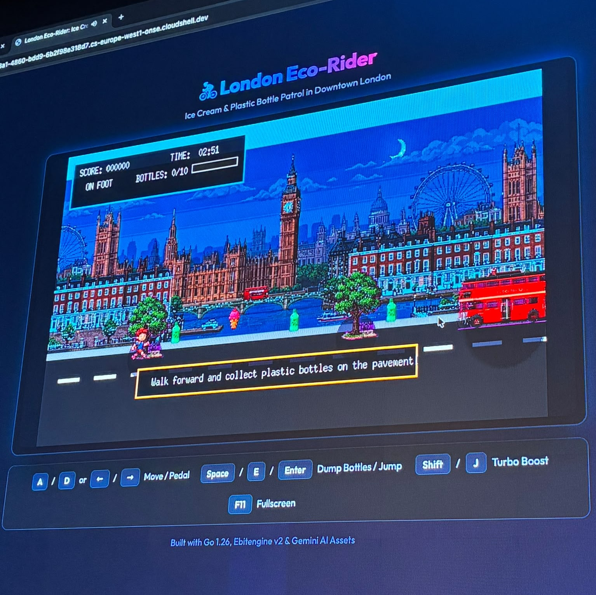
*Ivan S's "London Eco-Rider: Ice Cream & Bottle Patrol" running on Google Cloud Shell during the showcase.*

### 🎮 Project Showcase & Submissions

| Game / Entry | In-Game Action / Gameplay |
| :---: | :---: |
| 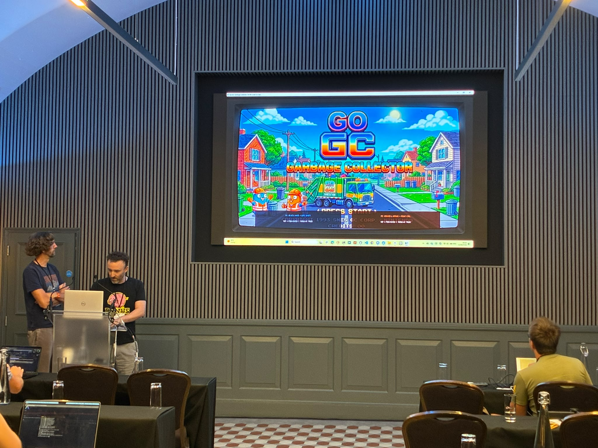<br>**Go GC: Garbage Collector** (Title Screen)<br>_Retro 16-bit SNES-style title screen presentation_ | 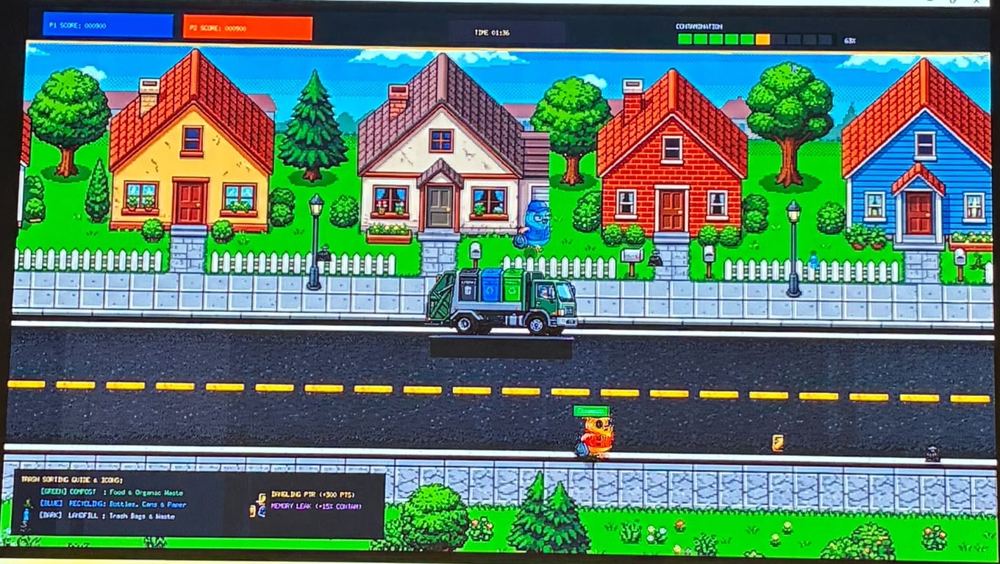<br>**Go GC: Garbage Collector** (Gameplay)<br>_Side-scrolling street cleanup sorting compost, recycling, and dangling pointers_ |
| 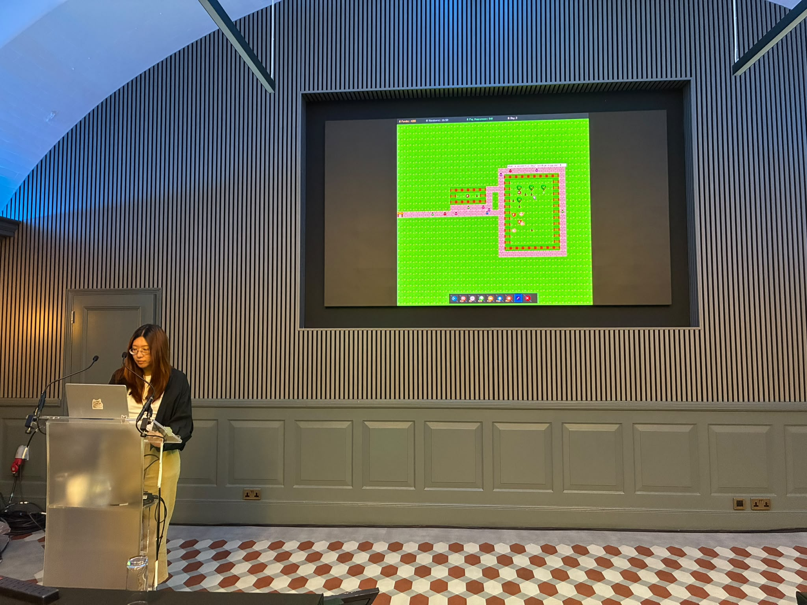<br>**Guinea Pig Farm Simulator**<br>_Top-down farm simulation & visitor happiness manager_ | 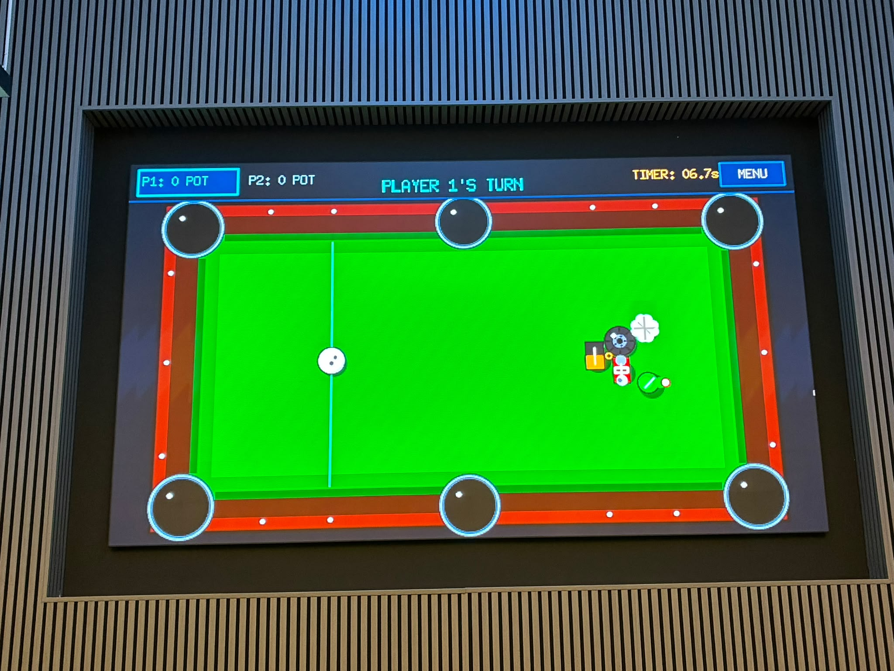<br>**Trash Pool**<br>_2-player turn-based billiards potting trash into pockets_ |
| 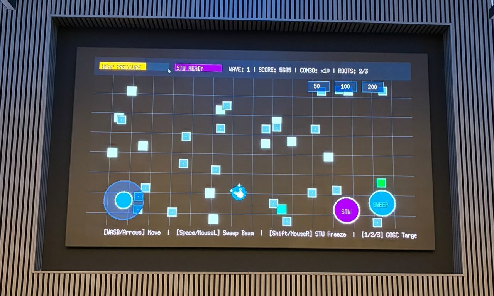<br>**Go GC: Garbage Collector Game**<br>_You are Go's garbage collector! Memory management mechanics featuring Stop-The-World freezes and more. Don't clean memory that is still in use!_ | 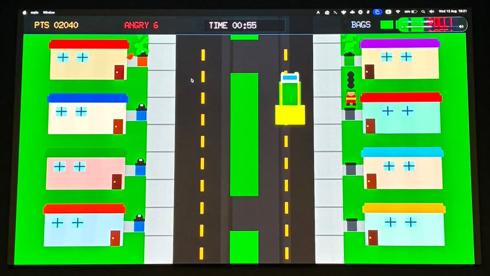<br>**Suburban Garbage Collector**<br>_Your friendly neighbourhood garbage collector. Don't let the garbage accumulate or it will start to smell!_ |
| 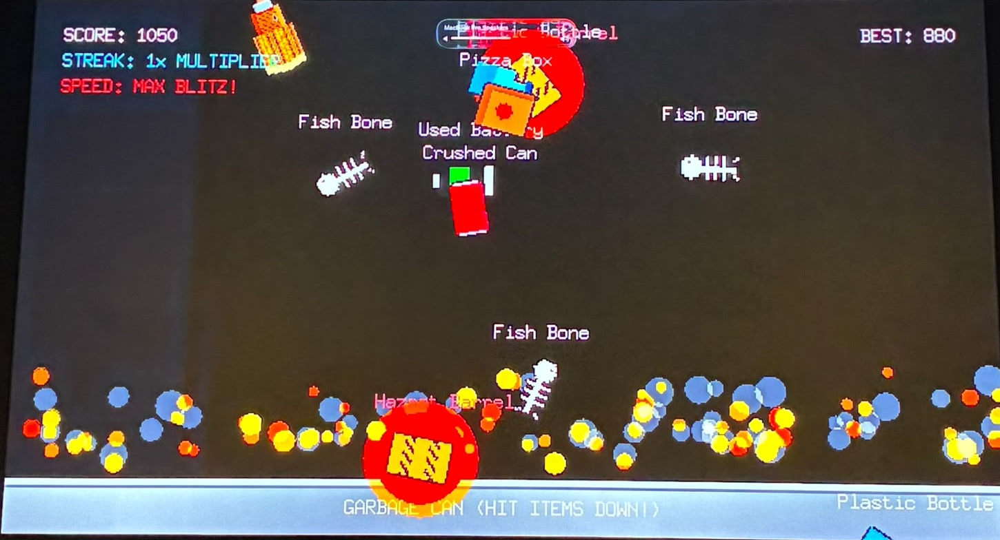<br>**Fast Blitz Item Sorter**<br>_High-speed arcade reflex item sorting game. Oh no, it's on fire!!!_ | |
